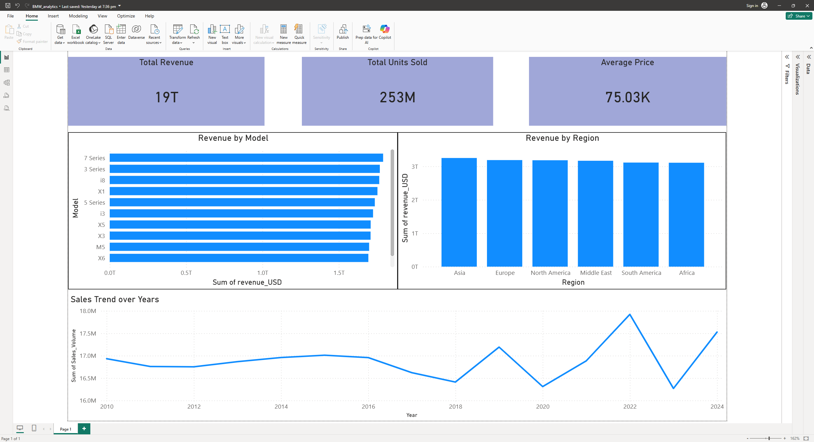
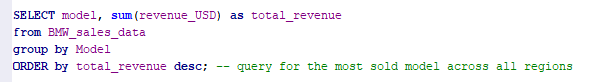
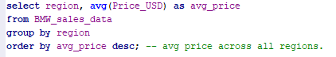
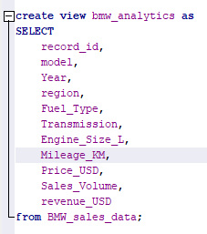

# BMW Sales Analytics

## Overview
This project analyzes BMW sales data using SQL and Power BI to understand revenue performance, model popularity, and regional sales trends.

The dataset was cleaned and transformed using SQL before being used to build a Power BI dashboard for business insights.

---

## Tools Used
- SQL (SQLite)
- Power BI

---

## Data

The repository contains both the **raw dataset** and the **cleaned analytics dataset**.

- `data/bmw_raw.csv` → Original dataset
- `data/bmw_analytics.csv` → Cleaned dataset used for analysis and dashboard creation

---

## Dashboard

The dashboard includes:

- Total Revenue KPI
- Total Units Sold KPI
- Average Price KPI
- Revenue by Model
- Revenue by Region
- Sales Trend by Year

---

## SQL Transformations & Queries

Example SQL queries used during the analysis:

### Average Price by Region

### Revenue by Model

### Creating Analytics View

---

## Project Goal
The objective of this project was to demonstrate a typical data analytics workflow:

1. Data preparation and transformation using SQL
2. Creating derived business metrics such as revenue
3. Analyzing model and regional performance
4. Building an interactive dashboard for business insights
